# 2025年排名前13的加密货币兑换平台汇总(最新整理)

在加密世界里折腾，是不是经常觉得又麻烦又没谱？想在不同币种之间换来换去，要么得在交易所里填一堆注册信息，要么就是担心自己的币放在别人那里不安全。这篇文章就是为你准备的，咱们聊聊那些不需要注册、直接点对点交易的**加密货币兑换**平台。看完你就能知道怎么选，让**匿名交易**和跨链操作变得像发个消息一样简单。

## **[SideShift.ai](https://sideshift.ai)**
一个让你无需账户、直接在钱包间完成交易的“狠角色”。

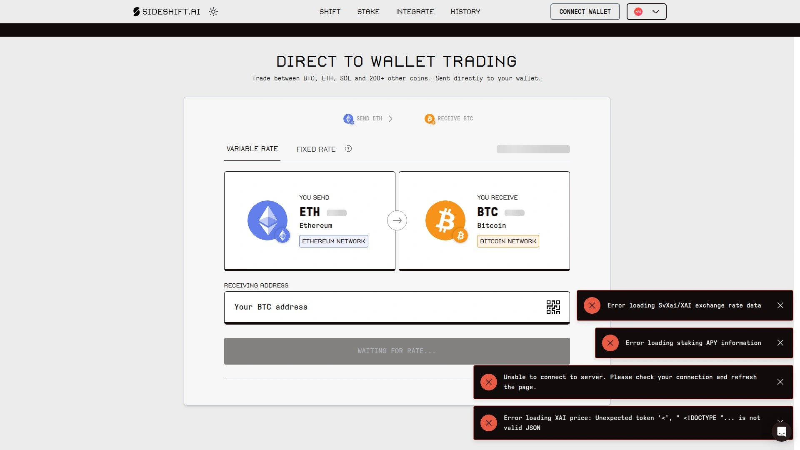

SideShift.ai 主打的就是一个快和直接。你不需要创建账户或经过繁琐的验证流程，就能在超过200种加密货币之间进行快速兑换。它的整个过程是“非托管”的，意味着你的资产从头到尾都由自己掌控，平台只是处理交换。

**核心看点：**
* **广泛的集成**：它被许多知名的硬件和软件钱包集成，比如 Trezor、Edge Wallet 和 Bitcoin.com Wallet，你可以在这些钱包应用里直接使用它的兑换服务。
* **开发者友好**：提供强大的 API，允许开发者将兑换功能无缝集成到自己的应用或服务中。
* **隐私性强**：由于不需要账户，用户的交易隐私得到了很好的保护。
* **支持广泛**：支持超过40个区块链网络，无论是主流的 BTC、ETH，还是各种小众代币，覆盖面都很广。

## **[ChangeNOW](https://changenow.io)**
一个专注于提供无限额、免注册加密货币交换的服务平台。

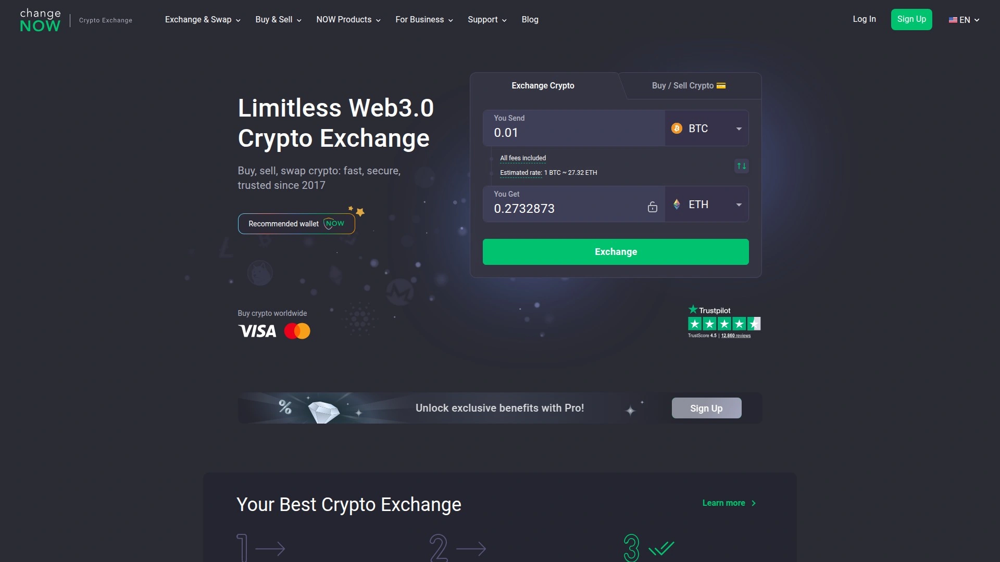

ChangeNOW 致力于让加密货币兑换变得简单快捷。平台支持超过950种加密货币，并且不设兑换上限，对于大额交易者来说非常方便。它同样采用非托管模式，确保了用户的资金安全。

**适用场景：**
* 需要快速兑换大量或多种不同类型加密货币的用户。
* 希望找到一个界面简洁、操作直观的兑换工具。
* 与其他服务集成，提供流动性解决方案。

## **[SwapSpace](https://swapspace.co)**
一个加密货币兑换聚合器，帮你“货比三家”找到最佳汇率。

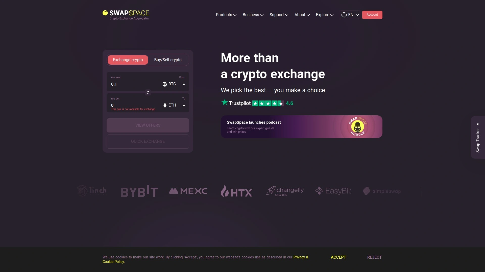

你不用再一个个去查不同平台的汇率了，SwapSpace 帮你搞定。它整合了超过15家主流兑换服务的数据，实时展示给你最佳的交易选项。平台支持420多种加密货币，也是免注册、非托管的模式，用起来非常省心。

**主要优势：**
* **汇率透明**：一次性比较多个平台的浮动和固定汇率。
* **选择多样**：支持数千个交易对，几乎能满足所有兑换需求。
* **用户支持**：提供24/7在线客服，遇到问题能及时解决。

## **[THORChain](https://thorchain.org)**
一个真正去中心化的跨链流动性协议，能直接交换原生资产。

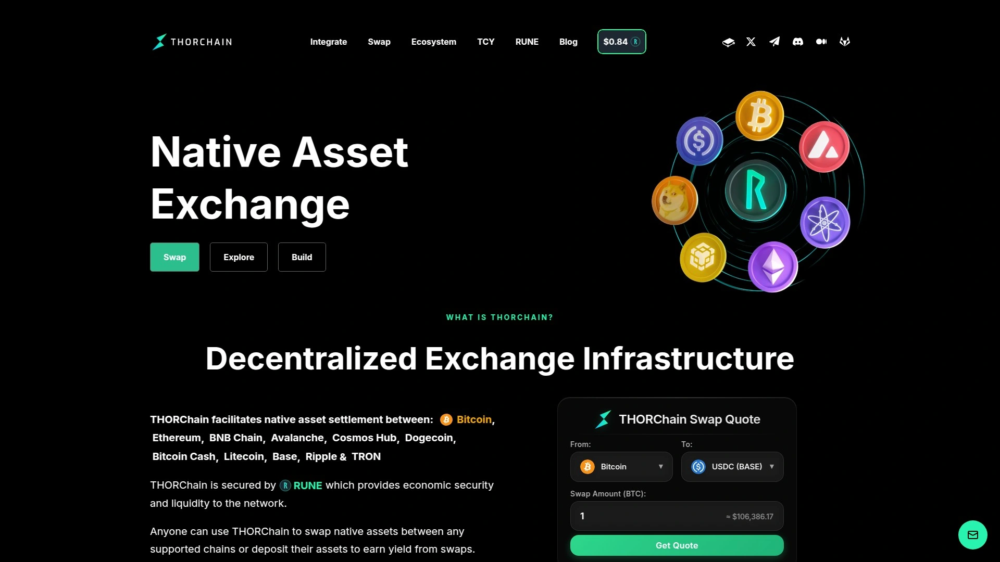

跟其他平台不同，THORChain 允许你直接交换不同区块链上的原生资产，比如用真正的 BTC 换成真正的 ETH，而不需要通过“包装代币”或中心化中介。它通过去中心化的流动性池和自动做市商（AMM）机制来实现这一点，是技术流玩家的最爱。

**推荐理由：**
* **真正的跨链**：无需信任第三方，实现原生资产的去中心化交换。
* **完全掌控**：用户在整个交易过程中始终掌握自己的私钥。
* **无需KYC**：任何人都可以匿名参与交易和提供流动性。

## **[SimpleSwap](https://simpleswap.io)**
一个支持超过1500种加密货币的便捷兑换平台。

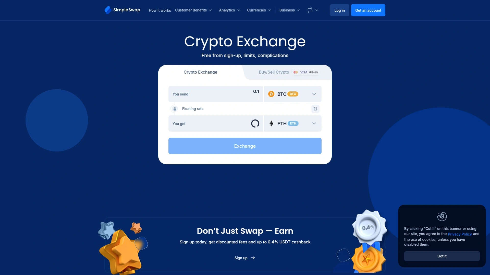

SimpleSwap 的名字就说明了它的特点：简单。它提供了一个非常友好的用户界面，让新手也能轻松上手。你可以选择固定汇率来锁定价格，也可以选择浮动汇率来获得潜在的更优价格。

**亮点功能：**
* **海量币种**：支持的加密货币种类非常多，适合寻找小众币种的用户。
* **灵活性高**：提供固定和浮动两种汇率选项。
* **客户服务**：拥有良好的用户评价和可靠的客户支持。

## **[Changelly](https://changelly.com)**
一个老牌的即时加密货币交换平台，以其稳定的服务和广泛的合作著称。

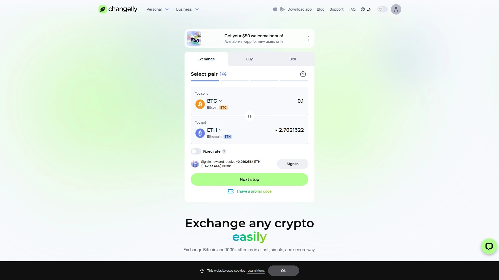

自2015年以来，Changelly 一直是加密货币交换领域的知名品牌。它与 Exodus、Ledger、Trezor 等多家主流钱包建立了合作关系，用户可以在这些钱包中直接使用 Changelly 的服务。

**核心价值：**
* **可靠性**：作为行业内的早期参与者，拥有长期的运营记录和良好的声誉。
* **生态系统**：与众多钱包和加密服务商深度集成，使用场景广泛。
* **固定费率**：提供清晰、一致的费率结构。

## **[Swapzone](https://swapzone.io)**
另一个强大的汇率聚合器，尤其适合交易各类山寨币。

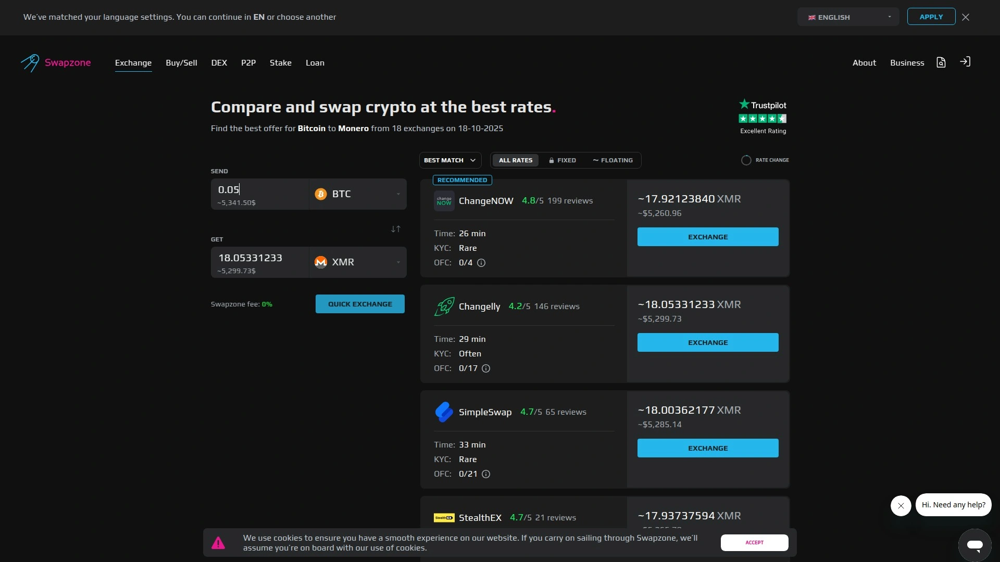

和 SwapSpace 类似，Swapzone 也是一个汇率比较平台。它聚合了数十家兑换服务商的实时报价，并排展示，让你一目了然地找到最划算的交易。平台同样无需注册和KYC，非常适合注重隐私和交易透明度的用户。

**适用人群：**
* 专注于交易各种非主流代币（Altcoins）的用户。
* 希望通过比较找到最低交易成本的交易者。

## **[RocketX Exchange](https://www.rocketx.exchange)**
一个支持超过200条链的跨链交换和桥接聚合器。

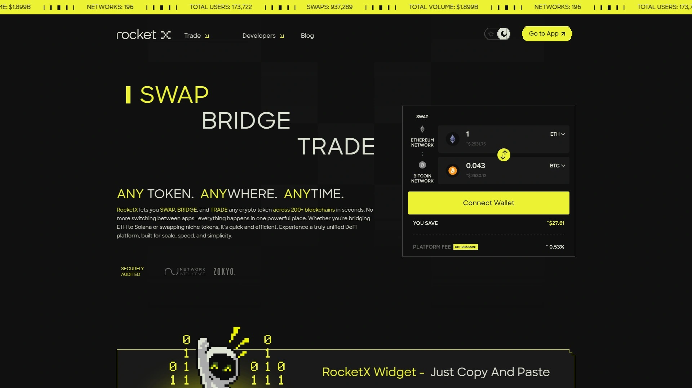

RocketX 不仅支持代币兑换，还专注于跨链桥接功能，帮助用户在不同的区块链网络之间轻松转移资产。它整合了多家顶级的DEX和跨链桥，旨在为用户提供最快、最安全的交易路径。

## **[CoW Swap](https://swap.cow.fi)**
一个旨在帮你省钱的智能DEX聚合器。

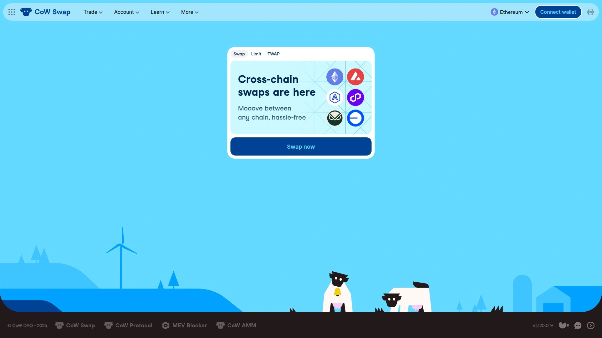

CoW Swap 的独特之处在于它能有效防范“矿工可提取价值”（MEV）攻击，避免你的交易被机器人抢跑而导致损失。它会先尝试在用户之间进行点对点交易（Coincidence of Wants），如果找不到匹配的对手，再通过其他DEX聚合器寻找最优价格，帮你省下每一分钱。

## **[Exodus](https://www.exodus.com)**
一款内置了强大兑换功能的多功能加密钱包。

Exodus 本身是一个非常受欢迎的非托管钱包，支持桌面和移动端。它的亮点在于内部集成了多个兑换服务提供商的API，让用户可以直接在钱包内部安全地完成资产交换，无需将币转移到交易所。

## **[LocalCoinSwap](https://localcoinswap.com)**
一个全球化的点对点（P2P）加密货币市场。

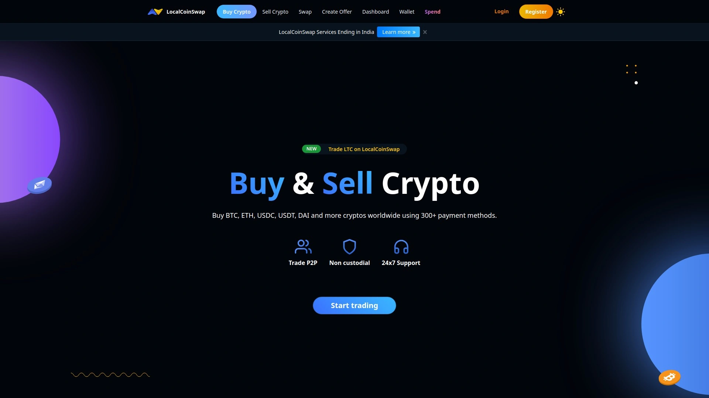

与自动兑换平台不同，LocalCoinSwap 更像一个“加密货币的淘宝”。你可以在上面找到来自世界各地的买家和卖家，支持数百种支付方式。它是一个非托管的P2P平台，你可以直接与交易对手进行沟通和交易。

## **[Bybit](https://www.bybit.com)**
一家以衍生品交易闻名，但同样提供便捷现货兑换服务的大型交易所。

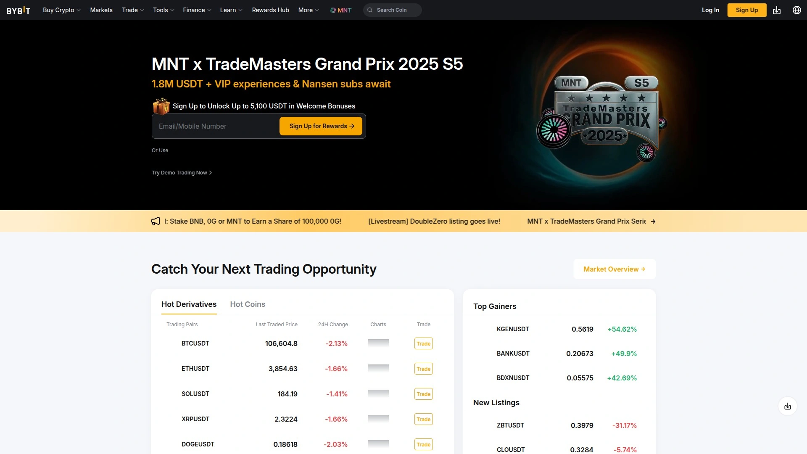

虽然 Bybit 以其期货合约和高级交易功能而闻名，但它的现货交易和兑换功能也非常强大。对于已经在使用 Bybit 进行交易的用户来说，其内部的“兑换”功能可以一键完成不同币种之间的转换，非常方便。

## **[KuCoin](https://www.kucoin.com)**
被誉为“山寨币天堂”的全球性交易所，提供丰富的交易对。

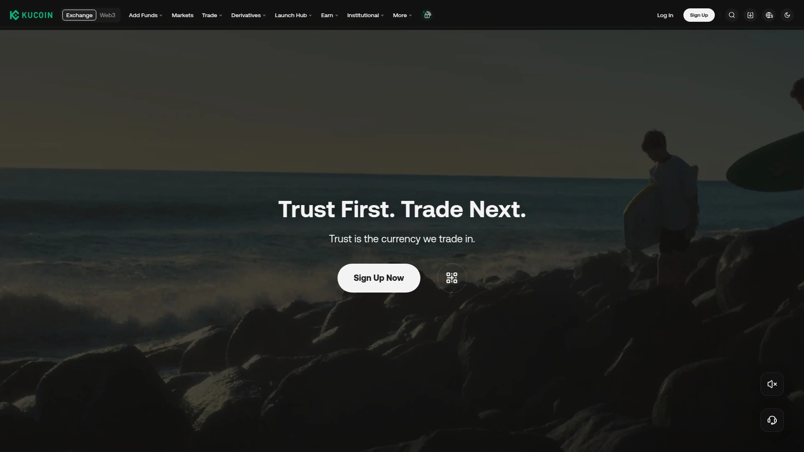

KuCoin 以其庞大的币种库而著称，很多新项目会选择在这里首发。除了专业的交易界面，它也提供了简单的“闪兑”功能，用户可以快速完成币种转换，而无需处理复杂的订单簿。

***

## **常见问题 (FAQ)**

**1. 如何选择最适合我的加密货币兑换平台？**
这取决于你的核心需求。如果你追求极致的匿名和便捷，可以选择像 **SideShift.ai** 这样的免注册平台；如果你想找到最划算的价格，可以使用 SwapSpace 或 Swapzone 这样的聚合器；如果你需要进行原生资产的跨链交易，THORChain 是一个不错的选择。

**2. 这些不需要KYC的平台安全吗？**
它们大多采用“非托管”模式，这意味着你的私钥和资产始终由你自己控制，平台无法动用你的资金。这种安全模型与将资产存放在中心化交易所完全不同，从某种程度上说，只要你保管好自己的钱包，资金就是安全的。

**3. 兑换聚合器和直接兑换服务有什么区别？**
直接兑换服务（如 ChangeNOW）使用自己的流动性或固定合作渠道来完成交易。而聚合器（如 SwapSpace）则像一个搜索引擎，它会同时向多个兑换服务发起查询，然后把最好的结果呈现给你，让你做出选择。

***

## **总结**

总的来说，无论是为了隐私、便捷还是更优的价格，市面上总有一款加密货币兑换工具能满足你的需求。在体验了众多平台后，如果你是一个高度重视隐私、希望操作流程极简、并且需要直接在钱包之间完成**跨链交易**的用户，那么[SideShift.ai](#sideshiftai)绝对是值得首选的方案，它把复杂的技术封装得简单易用，让每个人都能轻松掌控自己的数字资产。
